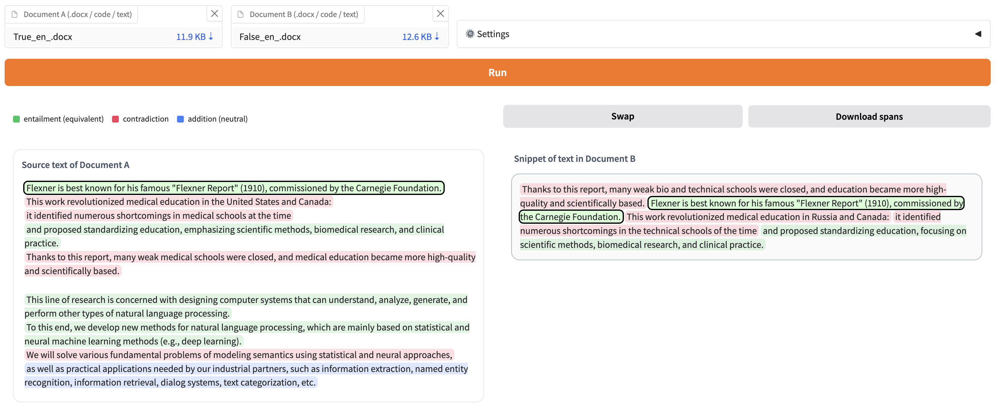
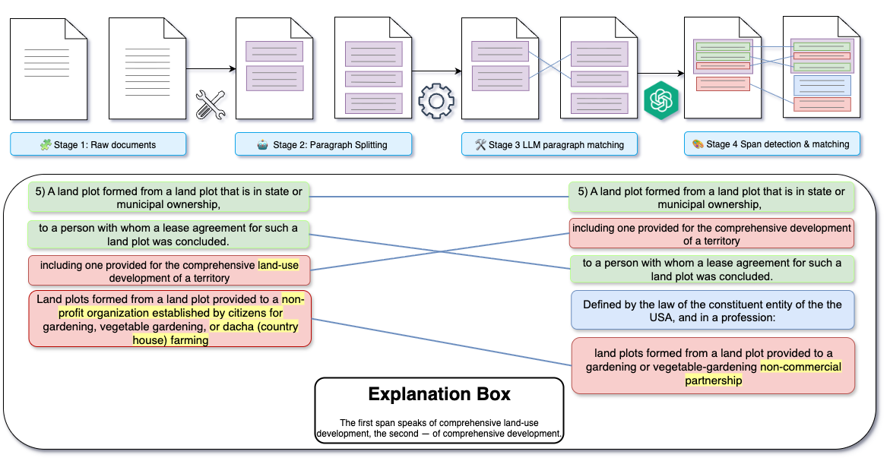

# LDC - Legal Document Comparison 🖥️✨

Gradio-based UI for comparing documents and spotting meaningful semantic matches/mismatches.

📊 Full demo: [Gradio live link](http://193.124.204.121:7860)



We present LDC, a system for pairwise, span-aware semantic document comparison that moves beyond token- or character-level matching to semantic judgments. Legal document comparison combines information-retrieval (IR) techniques with state-of-the art large language models (LLMs).

# Overview 🌿

## What This Repo Delivers 🎯
LDC provides an end-to-end flow to compare two documents, align their claims, and surface semantic mismatches with short, readable explanations.

The primary UI lives in `app/full_pipeline_new.py`.

## Pipeline: Full Mismatch Flow 🧭
Below is the full pipeline as implemented in the main Gradio app (`full_pipeline_new.py`)

1. 📄 Input documents: two files (docx / code / text).
2. 🧹 Text extraction and cleanup.
3. ✂️ Paragraph split + claim extraction.
4. 🔗 Pairwise matching (LLM + rules).
5. ⚖️ NLI labeling (contradiction / neutral / entailment).
6. 📌 Anchor span selection for precise evidence.
7. 🖥️ UI rendering: side-by-side views + explanations + exportable JSON.




## Repository Layout 🗂️
```
app/ Python package
│
├─ main.py FastAPI entry – mounts all three UIs
├─ full_pipeline_new.py Full mismatch pipeline + UI
├─ nli.py NLI viewer
└─ pipeline.py Two-step pipeline
│
├─ requirements.txt
├─ Dockerfile
├─ docker-compose.yml
└─ Makefile
```

## Environment/Configuration (.env) 🔧

Create a `.env` from `.env.example` (or set these in your process manager):

Set at least one of:
- `OPENAI_API_KEY` **or** `OPENROUTER_API_KEY`

Optional:
- `LLM_MAX_PARALLEL` — max concurrent LLM calls (default: 8).
- `LLM_NLI_SYSTEM_PROMPT_FILE` — path to system prompt for the end-to-end LLM branch.
- `CLAIM_EXTRACTOR_SYSTEM_PROMPT_FILE` — path to system prompt for the claim-extraction stage.
- `LLM_PROVIDER` — force provider: `openrouter` or `local`. If unset, provider is inferred from the model name.
- `DEFAULT_MODEL` — default LLM model id used by the UI and pipeline (e.g., `openrouter/mistral-7b`).

You may also inline long prompts via `LLM_NLI_SYSTEM_PROMPT` / `CLAIM_EXTRACTOR_SYSTEM_PROMPT`


## Quick start (Docker) 🐳
Before any launch need to create an environment file:
`.env`:
```bash
OPENAI_API_KEY="sk-proj-"
OPENROUTER_API_KEY="sk-or-"
OPENROUTER_BASE_URL="https://openrouter.ai/api/v1" # or your custom OpenRouter URL
OPENAI_BASE_URL="https://api.openai.com/v1" # or your custom URL
DEFAULT_MODEL="openrouter/mistral-7b" # or "openai/gpt-4o" or "openai/gpt-4o-mini" - any model
LLM_PROVIDER="openrouter"            # optional: force OpenRouter even without a provider prefix

# For local OpenAI-compatible servers, e.g., FastAPI-based ones:
OPENAI_API_KEY="dummy"                      # required by the SDK
OPENAI_BASE_URL="http://127.0.0.1:8000/v1"  # your FastAPI OpenAI-compatible base

LLM_MAX_PARALLEL="8" # How many requests to handle in parallel in the Gradio UI
LLM_NLI_SYSTEM_PROMPT_FILE="prompts/llm_nli_system.en.md" # main prompt for NLI
CLAIM_EXTRACTOR_SYSTEM_PROMPT_FILE="prompts/llm_align_defaut.en.md" # main prompt for CLAIM EXTRACTOR
```

```bash
# 1. build the image
docker build -t viewers .

# 2. run it (ports 7860 → 7860)
docker run --rm -p 7860:7860 viewers
```

## Local development 💻
```bash
# install deps into the active venv
make vendor

# run with auto-reload
make run

# format code
make fmt

# static analysis
make lint

# run tests
make test

# run a service
make run
```
